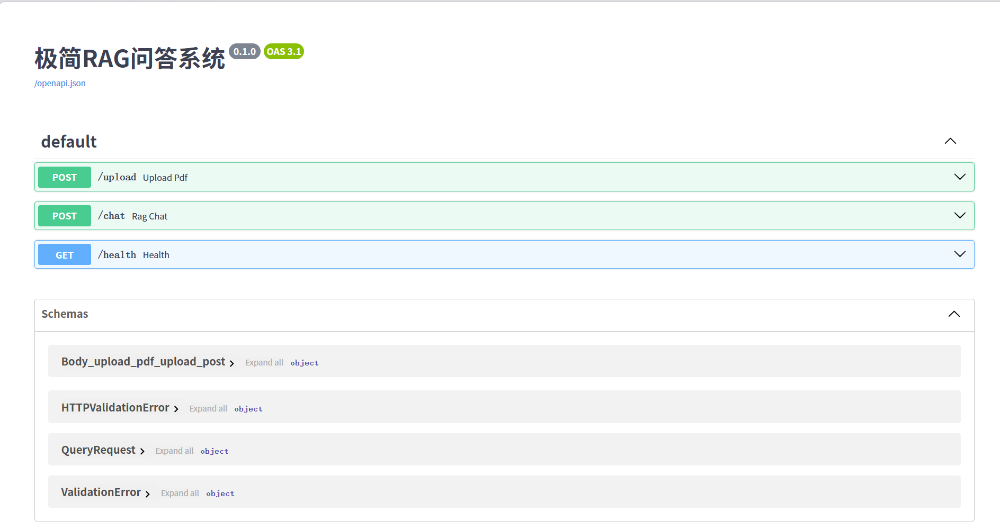

# 极简 RAG 问答系统

基于 LangChain + FastAPI 的本地文档智能问答服务，支持多种文档格式上传、混合检索（BM25 + 语义向量）和重排序，提供 RESTful API 接口。

## 架构概览
用户上传文档 → 文档加载与切分 → 向量化存储（Chroma）
↓
BM25 索引（内存）
↓
用户提问 → 混合检索 + 重排序 → 拼接 Prompt → 大模型生成答案

所有组件通过 FastAPI 管理，支持启动时自动恢复历史文档索引。

## 功能特性
- 支持 PDF、Word、TXT、Markdown 等多种文档格式
- 混合检索：BM25 + 语义向量，结合重排序模型提升准确度
- 一键上传文档，动态更新知识库
- 持久化向量库，重启不丢失
- 流式问答接口，返回答案及引用来源

## 技术栈
- **后端框架**：FastAPI
- **大语言模型**：通义千问（阿里云 DashScope）
- **嵌入模型**：DashScope text-embedding-v2
- **重排序模型**：BAAI/bge-reranker-base（支持离线加载）
- **向量数据库**：Chroma
- **文档处理**：LangChain Community Loaders
- **其他**：rank_bm25, sentence-transformers

## 快速启动

### 1. 环境准备
- Python 3.10+
- 安装依赖：`pip install -r requirements.txt`

### 2. 配置环境变量
在项目根目录创建 `.env` 文件，写入：
```ini
model_name=qwen-max
DASHSCOPE_API_KEY=你的阿里云API密钥
embedding_model_name=text-embedding-v2

3. 放置重排序模型（可选，若无法联网）
将模型文件夹 bge-reranker-base 放到 local_models/ 下，或在 retriever.py 中指定本地路径。

4. 启动服务
uvicorn api:app --host 0.0.0.0 --port 8000 --reload
5. 访问接口文档
浏览器打开 http://localhost:8000/docs 即可看到交互式 Swagger UI。

API 接口
方法	路径	说明
POST	/upload	上传文档（支持多格式）
POST	/chat	提出问答请求
GET	/health	健康检查
详细参数与返回示例见 Swagger 文档。

项目结构
.
├── api.py                 # FastAPI 主程序
├── rag_package/           # 核心功能包
│   ├── config.py          # 配置与环境变量
│   ├── loader.py          # 文档加载器（多格式支持）
│   ├── retriever.py       # 检索器构建（混合检索+重排序）
│   └── chain.py           # RAG 链及回答函数
├── requirements.txt       # Python 依赖
├── .env                   # 环境变量（勿提交）
├── .gitignore
└── README.md

Swagger UI 截图示例

